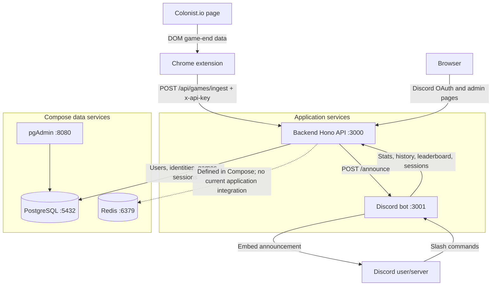

# Repository Architecture

This repository contains three TypeScript applications and a Docker Compose
environment. The extension captures game data, the backend owns authentication
and persistence, and the Discord bot provides commands and game announcements.



## Repository layout

```text
.
|-- docker-compose.yml       # Full local stack: API, bot, PostgreSQL, Redis, pgAdmin
|-- docker-compose.dev.yml   # Source mounts and watch commands for API and bot
|-- .env.example              # Local configuration template
|-- backend/
|   |-- src/index.ts          # Hono API entry point, port 3000 by default
|   |-- routes/               # Auth, game ingestion, Discord-facing, and admin routes
|   |-- services/             # Database-backed user, game, session, and admin logic
|   |-- schemas/              # Zod request schemas, including game payload validation
|   |-- db/                   # PostgreSQL connection, initialization SQL, pgAdmin config
|   |-- views/                # Server-rendered TSX success and admin pages
|   `-- Dockerfile
|-- discord-bot/
|   |-- src/index.ts          # Discord client and internal HTTP server entry point
|   |-- commands/             # Slash command implementations
|   |-- api/internalRoutes.ts # POST /announce endpoint used by the backend
|   |-- core/                 # API client, command loading, and shared bot types
|   |-- utils/                # Discord embed generation
|   `-- Dockerfile
`-- extension/
    |-- src/content.ts        # Colonist page scraping and game submission
    |-- src/scraper.ts        # Scraper strategies for overview and stat tables
    |-- src/coordinator.ts    # Runs the scraper strategies as one crawl
    |-- src/background.ts     # Stores API credentials and controls extension state
    |-- src/popup.ts          # Extension popup UI and connection state
    |-- src/style.css         # Popup/content styling
    `-- manifest.json         # Chrome extension permissions and content-script wiring
```

## Runtime responsibilities

### Chrome extension

The content script runs on `colonist.io` and watches for completed games. It
uses scraper strategies to collect player overview, dice, resource, development
card, activity, and resource statistics. The coordinator combines those
results into one payload.

The extension stores the user's `discordId` and API key in
`chrome.storage.local`. It sends the payload to
`POST /api/games/ingest` with the API key in the `x-api-key` header. The
background service worker handles credentials received through the external
connection and displays success or error state in the extension.

### Backend API

`backend/src/index.ts` creates the Hono application and mounts these route
groups:

- `/api/auth`: Discord OAuth login and callback.
- `/api/games`: authenticated game ingestion.
- `/api/discord`: user stats, history, leaderboards, identity lookup, and
  active sessions used by the bot and extension.
- `/admin`: server-rendered admin login, user and identity management, games,
  and analytics pages.

The services use the PostgreSQL pool in `backend/db/db.ts`. Game ingestion is
validated with `schemas/gameSchema.ts`, resolves linked Catan names through
`UserService`, adopts a guild/channel from an active session when available,
and writes the game and all player rows in one database transaction through
`GameService`.

After a successful guild game upload, the backend calculates a match summary
and calls the bot's `/announce` endpoint. The bot then posts the summary as a
Discord embed.

### Discord bot

`discord-bot/src/index.ts` loads and registers command modules, logs in with the
Discord token, and starts a small Hono server on port `3001`. Commands use
`ApiClient` to call the backend. The internal `/announce` route uses the
connected Discord client to find a channel and send the generated match-summary
embed.

### PostgreSQL and pgAdmin

The initialization script creates the relational model:

- `users` and `catan_identities` map Discord accounts to Catan names.
- `games` stores game-level metadata and JSONB statistic blocks.
- `player_stats` stores each player's score, winner/bot flags, identity, and
  statistic blocks.
- `pending_sessions` associates a user with a Discord guild and channel while
  a game is being played.
- `admin_users` and `admin_sessions` support the admin web interface.
- `user_stats_view`, `leaderboard_view`, and `history_view` provide reporting
  queries used by the API and admin pages.

pgAdmin is exposed at `http://localhost:8080` and connects to the Compose
PostgreSQL service using the configuration under `backend/db/`.

Redis is started by `docker-compose.yml` for local infrastructure, but the
current backend does not create a Redis client or use `REDIS_URL` in its
application logic.

## Main request flows

1. **Account linking:** A browser starts Discord OAuth through the backend.
   The callback creates or updates the user and returns a success page that
   communicates the user's API key to the extension.
2. **Game upload:** The extension scrapes the finished game, marks the local
   player, validates the request with the API key, and posts it to the backend.
3. **Persistence and identity linking:** The backend links known Catan names,
   determines the relevant guild session, and transactionally upserts the game
   and player statistics in PostgreSQL.
4. **Discord reporting:** The bot reads stats through backend routes. For a
   guild upload, the backend sends a match summary to the bot, which announces
   it in Discord.
5. **Administration:** An authenticated admin uses `/admin` to manage users,
   Catan identities, games, and analytics rendered by the backend.

## Current boundaries

The repository currently does not contain a separate reconciliation engine,
CSV export worker, standalone React dashboard, ELO calculation pipeline, or
Google Sheets integration. Those would be additional components rather than
parts of the current runtime architecture.